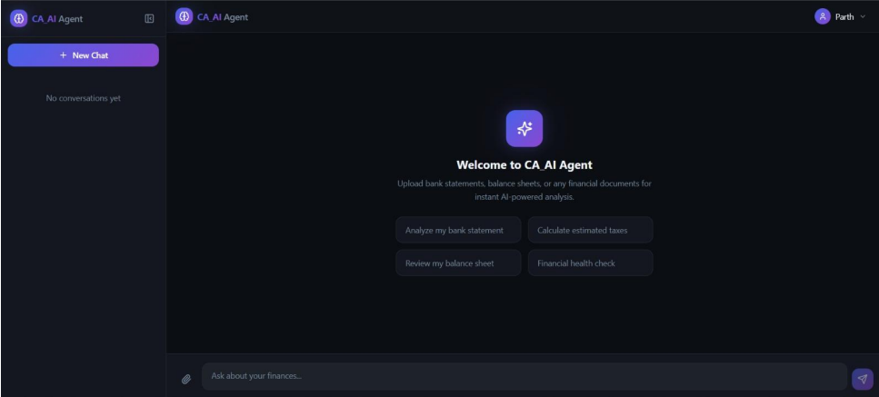
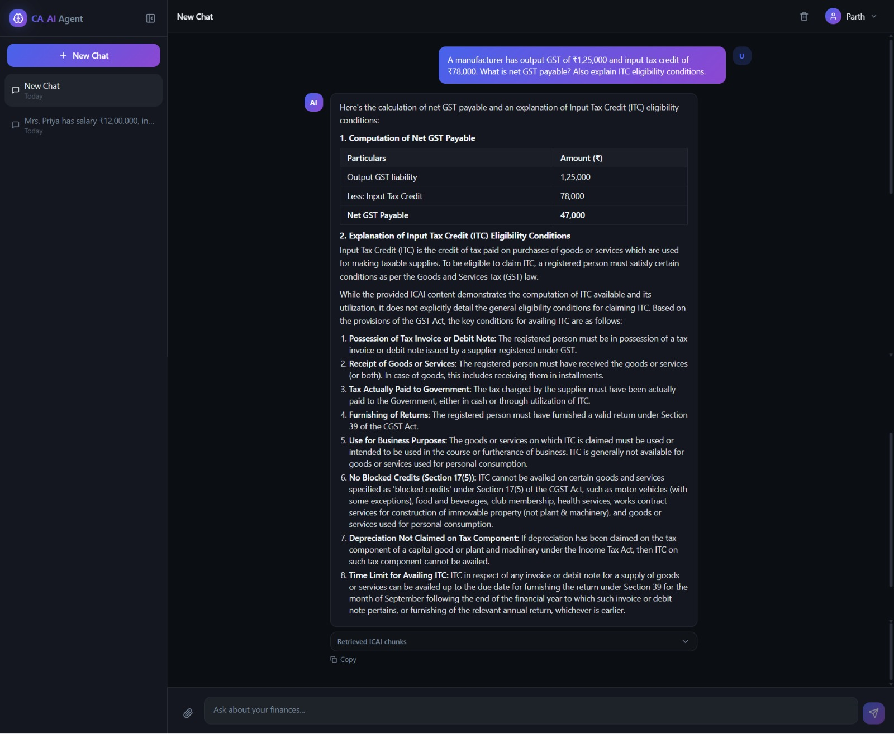
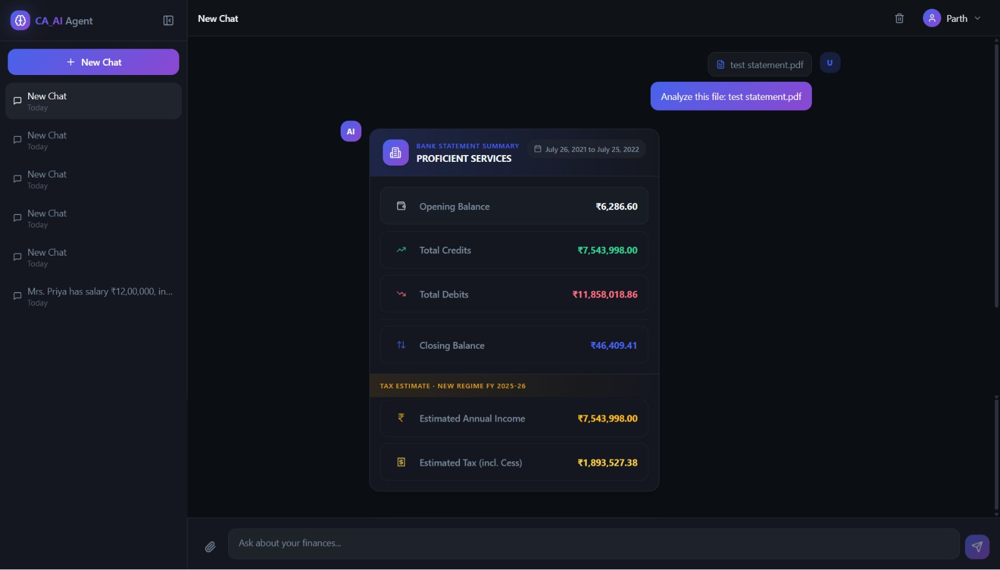
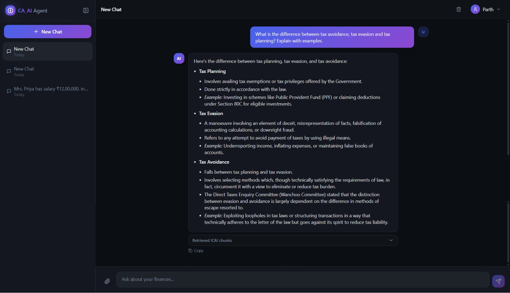
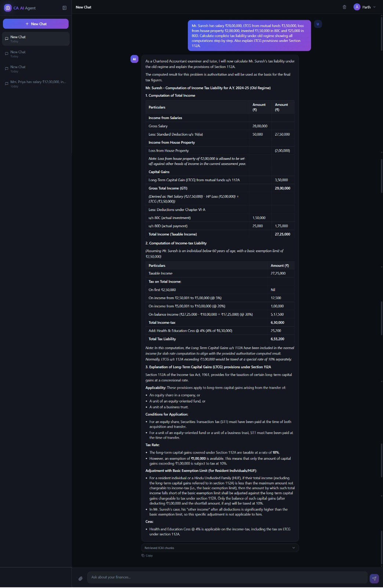

# ✦ CA AI Agent

An AI-powered Chartered Accountant assistant that lets you upload financial documents and ask tax, GST, and accounting questions — with answers grounded in ICAI study material.

---

## 📸 Preview



---

## ✨ What It Does

### Chat with a CA-trained AI
Ask any tax, GST, or accounting question and get detailed, structured answers backed by retrieved ICAI content.



### Upload bank statements & financial documents
Upload a PDF or image of your bank statement and instantly get a structured financial summary with tax estimates.



### Deep tax explanations
Get step-by-step breakdowns of complex topics like tax planning vs. evasion, ITC eligibility, Section 112A, and more.



### Complex tax computations
Ask multi-part tax computation problems — salary income, capital gains, house property loss, deductions — and get a complete working shown as a CA would present it.



---

## 🗂️ Project Structure

```
CA-AGENT/
├── api.py                        # FastAPI server — /upload and /ask endpoints
├── ca_agent.py                   # Financial query processing, tax/GST helpers
├── search.py                     # RAG pipeline — embeddings, retrieval, reranking
├── file_handler.py               # Gemini Vision document extraction
├── hyde.py                       # Optional HyDE query classification
├── metrics.py                    # Optional retrieval evaluation metrics
├── dev_config.py                 # Feature toggles and API key loading
├── embeddings_foundation.joblib  # Precomputed ICAI Foundation embeddings
├── embeddings_Intermediate.joblib
├── embeddings_Final.joblib
├── src/
│   ├── App.tsx                   # React app routes and providers
│   ├── main.tsx                  # App bootstrap
│   ├── contexts/
│   │   ├── AuthContext.tsx       # Login/signup state
│   │   └── ChatContext.tsx       # Chat sessions, localStorage, API calls
│   └── components/
│       ├── ChatArea.tsx          # Main chat UI
│       ├── ChatInput.tsx         # Message input and file upload
│       └── ChatMessage.tsx       # Message rendering with retrieval details
├── requirements.txt              # Python dependencies
└── package.json                  # Node dependencies
```

---

## 🚀 Getting Started

### Prerequisites
- Python 3.9+
- Node.js 18+
- [Ollama](https://ollama.ai/) running locally with the `bge-m3` model
- A Gemini API key from [Google AI Studio](https://aistudio.google.com/)

---

### Backend Setup

#### 1. Create and activate a virtual environment

```bash
python -m venv .venv

# Windows
.venv\Scripts\activate

# macOS / Linux
source .venv/bin/activate
```

#### 2. Install Python dependencies

```bash
pip install -r requirements.txt
```

#### 3. Set up environment variables

Create a `.env` file in the project root:

```env
GEMINI_API_KEY=your_gemini_api_key
```

Optional variables:

```env
VITE_API_URL=http://localhost:8000
ENABLE_HYDE=false
ENABLE_METRICS=false
DEV_GEMINI_API_KEY=your_dev_gemini_api_key
OLLAMA_URL=http://localhost:11434
```

#### 4. Start Ollama (required for embeddings)

```bash
ollama serve
ollama pull bge-m3
```

#### 5. Start the API server

```bash
uvicorn api:app --reload --host 127.0.0.1 --port 8000
```

---

### Frontend Setup

#### 1. Install dependencies

```bash
npm install
```

#### 2. Start the dev server

```bash
npm run dev
```

Open `http://localhost:5173` in your browser.

---

## 🧠 How It Works

### Asking a question

1. You type a question in the chat
2. The backend retrieves the most relevant chunks from ICAI embeddings using `bge-m3` + cosine similarity
3. A CrossEncoder reranker refines the top results
4. Gemini generates a final answer using retrieved context + conversation history
5. The answer is displayed alongside expandable "Retrieved ICAI chunks"

### Uploading a document

1. You upload a bank statement (PDF, PNG, JPG, JPEG, WEBP)
2. Gemini Vision extracts structured data — balances, credits, debits, tax estimates
3. A clean financial summary card is shown in the chat
4. You can then ask follow-up questions about the document

---

## 🔌 API Endpoints

| Method | Endpoint | Description |
|---|---|---|
| `POST` | `/upload` | Upload and extract a financial document |
| `POST` | `/ask` | Ask a CA / tax / GST question |

---

## 📦 Tech Stack

**Backend** — Python, FastAPI, Uvicorn, Gemini AI, sentence-transformers, scikit-learn, Ollama (`bge-m3`), pandas

**Frontend** — React + TypeScript, Vite, Tailwind CSS, shadcn/ui, react-markdown, TanStack Query

---

## ⚙️ Optional Features

| Feature | Enable via |
|---|---|
| HyDE query expansion | `ENABLE_HYDE=true` in `.env` |
| Retrieval metrics | `ENABLE_METRICS=true` in `.env` |

---

## ⚠️ Known Limitations

- Conversations are stored in browser `localStorage` — clearing browser data will erase chat history
- The `.joblib` embedding files must be present in the working directory for RAG to work
- Only CSV, PDF, PNG, JPG, JPEG, and WEBP files are supported for document upload
- Gemini Vision extraction may struggle with complex or non-standard document layouts

---

## 🤝 Contributing

1. Fork the repo
2. Create a feature branch (`git checkout -b feature/my-feature`)
3. Make your changes
4. Open a pull request

Core CA logic lives in `ca_agent.py`. RAG retrieval is in `search.py`. To add new embedding corpora, add a `.joblib` file and load it in `search.py`.
